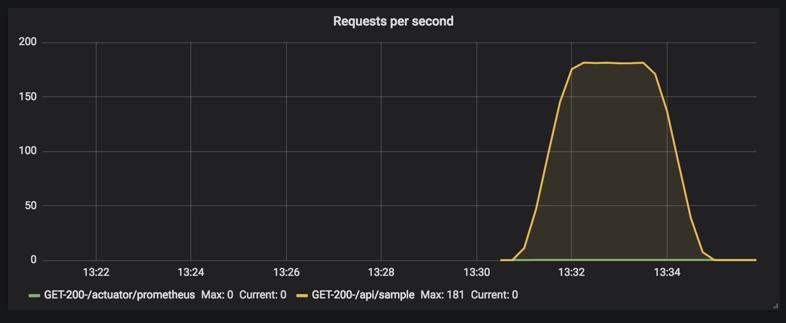
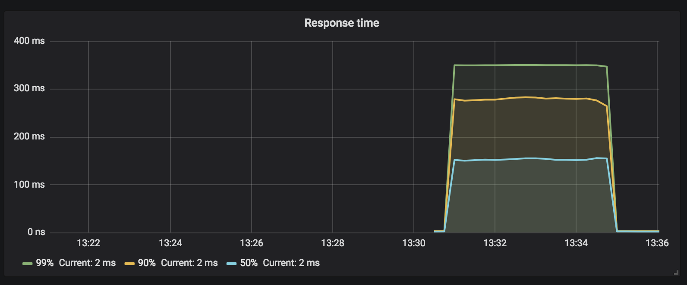

Sample Tryout Micrometer App
---

It's just a toy spring boot tryout micrometer application where I'm trying to find the request
throughput and latency.

### Tech Stack

  * [Java 8](http://www.oracle.com/technetwork/java/javase/downloads/jdk8-downloads-2133151.html)
  * [Maven](https://maven.apache.org/)
  * [Spring Boot 2](https://spring.io/projects/spring-boot)
  * [Spring Boot Actuator](https://spring.io/projects/spring-boot)
  * [Micrometer](https://micrometer.io/)
  * [Prometheus](https://prometheus.io/)
  * [Grafana](https://grafana.com/)
  * [Gatling](https://gatling.io/)
  * [Docker](http://docker.io/)  

### Design Overview

The application is configured to export [histogram](https://github.com/micrometer-metrics/micrometer-docs/blob/master/src/docs/concepts/histogram-quantiles.adoc) 
metrics by [Micrometer](https://micrometer.io/) where [Prometheus](https://prometheus.io/) keep listening to
`/actuator/prometheus` endpoint and [Grafana](https://grafana.com/) uses [Prometheus](https://prometheus.io/) as datasource, 
with that information we can create dashboards to check the application's throughput and latency.

>Sorry there's image for now

Spring Boot &rarr; Micrometer &rarr; Prometheus &rarr; Grafana


### Build & Run

#### Spring Boot App

To run the sample app just run the following command:

```bash
$ ./mvnw spring-boot:run
```

The app will be available at http://localhost:8080 and it contains only a single endpoint `/api/sample` in which
returns only a random `uuid`.

Sample request:
```bash
$ curl -i localhost:8080/api/sample

HTTP/1.1 200
Content-Type: text/plain;charset=UTF-8
Content-Length: 36
Date: Tue, 31 Jul 2018 09:48:11 GMT

66a20e40-2795-4666-b470-634b8768da3b
```

#### Prometheus

For this example I'm running Prometheus using docker, if you are going to do the same just edit 
the file `./monitor/prometheus/prometheus.yml` adding your own `IP` address, or the `IP` where you are running the
app.

**IMPORTANT**: *It's mandatory to change the IP in the following configuration otherwise [Prometheus](https://prometheus.io/)
 can not pull the data from the application.*

```yaml
global:
  scrape_interval: 15s
  evaluation_interval: 15s

scrape_configs:
  - job_name: 'spring'
    scrape_interval: 5s
    metrics_path: '/actuator/prometheus'
    static_configs:
      - targets: ['192.168.178.143:8080'] #Provide your IP here
```

If you are running everything locally you can use `localhost` as `IP`.

#### Grafana

As for Prometheus I'm running Grafana using docker and here you can find two files:
 
 * `./monitor/grafana/datasource.yml`
   * Configures Prometheus as datasource, you can also do it manually in case you have a 
     standalone Grafana instance running. 
 * `./monitor/grafana/dashboard-yml`
   * Contains the configuration pointing to the location where the dashboards are stored.

#### Run Prometheus & Grafana (Docker)

Everything related to Prometheus and [Grafana](https://grafana.com/) is properly configured using 
[Docker Compose](https://docs.docker.com/compose/), just run:

```bash
$ docker-compose up -d
```

Once it finishes you'll be able to access the [Grafana](https://grafana.com/) panel at http://localhost:3000, 
for the first login you might need to configure and username and password, the default value for both is `admin`.

### Load Test - Gatling 

Now that everything is settle you can just run the Gatling script for a load test using the following command:

```bash
$ mvn gatling:test
```

### Reports

#### Throughput



#### Latency

